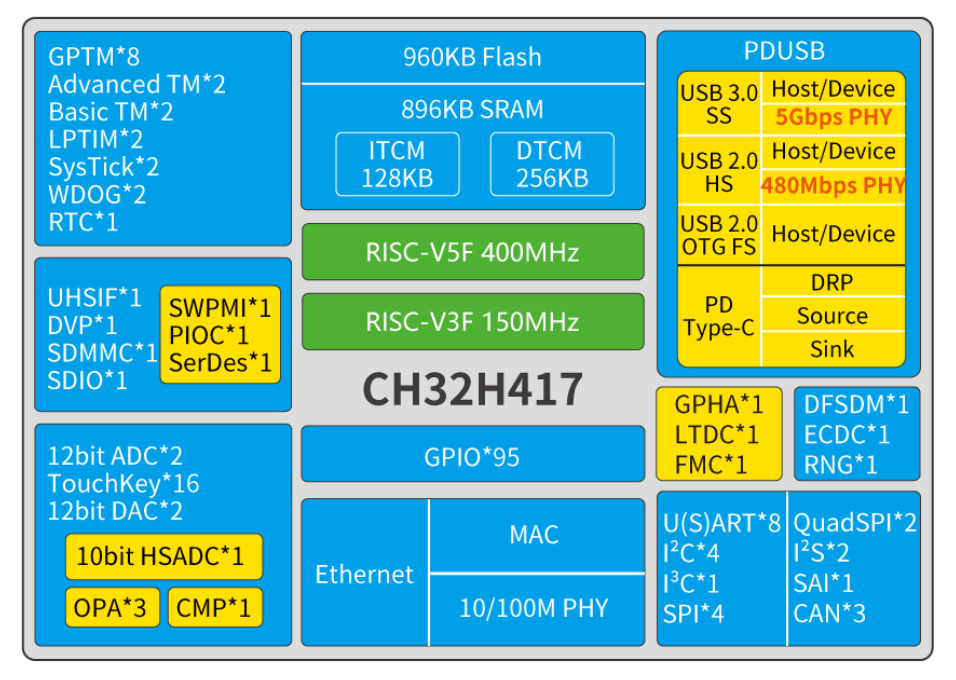

# 双内核设计的互联型通用微控制器 CH32H417

[EN](README.md) | 中文

### 概述

CH32H417是基于青稞RISC-V5F和RISC-V3F双内核设计的互联型通用微控制器。CH32H417集成了USB 3.2 Gen1控制器和收发器、百兆以太网MAC及PHY、SerDes高速隔离收发器、Type-C/PD控制器
及PHY，提供SD/EMMC控制器、500MBytes通用高速接口UHSIF、DVP数字图像接口、单线协议主接口SWPMI、可编程协议I/O 控制器PIOC、灵活存储控制器FMC、DFSDM、LTDC、GPHA、DMA 控制器、多组
定时器、8 组串口、I3C、4 组I2C、2 组QSPI、4 组SPI，2 组I2S、3 组CAN 等外设资源，内置了5M采样率双12位ADC单元、20M采样率10位高速HSADC单元、16路Touchkey、双DAC单元、3组运放
OPA、电压比较器CMP等模拟资源，支持10M/100M以太网通讯，支持USB 2.0和USB 3.0，支持USB Host主机和USB Device设备功能、Type-C和PDUSB快充功能，支持SerDes高速隔离及远距离传输，支持
双内核分工提升网络协议处理效率和通讯响应速度。

### 系统框图

### 产品特点

- 双内核结构：青稞RISC-V5F和RISC-V3F

- 快速可编程中断控制器+硬件中断堆栈

- V5F最高频率400MHz，V3F最高频率150MHz

- 896KB易失数据存储区SRAM（包含128KB ITCM和256KB DTCM）
- 960KB程序存储区CodeFlash
- 56KB系统引导程序存储区BootLoader
- 256B用户自定义信息存储区

- 系统供电VDD33额定：3.3V
- 常规GPIO供电VDDIO，额定3.3V，支持1.8V
- 高速GPIO供电VIO18，可选1.2/1.8/2.5/3.3V
- VBAT电源独立为RTC、LSE供电
- 低功耗模式：睡眠、停止

- 内置出厂调校的25MHz的RC振荡器
- 内置约40kHz的RC振荡器
- 高速振荡器支持外部25MHz晶体
- 低速振荡器支持外部32kHz晶体
- 上电/下电复位、可编程电压监测器

- 2组共16个DMA通道:支持环形缓冲区管理

- 2组12位模数转换ADC: 模拟输入范围：VSS~VDDIO,
  16路外部信号通道+2路内部信号通道,
  采样速率高达5Msps，支持双ADC转换模式

- 16路TouchKey通道检测

- 1组10位高速模数转换HSADC,模拟输入范围：VSS～VDDIO
  7路外部信号通道,采样速率高达20Msps

- 2组12位数模转换DAC

- 32位宽度125MHz通用高速接口UHSIF

- 150MHz数字图像接口DVP

- 200MHz双沿SD/EMMC控制器（SDMMC）

- SDIO主机/从机接口：支持SD/SDIO/MMC口

- 单线协议主接口SWPMI

- 可编程协议I/O控制器PIOC,可编程，支持多种单线接口、两线接口
  支持单线RGB芯片多级串联

- 以太网控制器MAC及10M/100M PHY：
  MAC和100M PHY全集成，外围只需要电容,
  支持Auto-MDIX线路自动转换和极性自适应,
  提供RGMII接口，可连接外置1000M PHY,
  内置预分配的全球唯一MAC地址

- 5Gbps超高速USB 3.0控制器及PHY：
  支持超高速的Host和Device模式,
  支持驱动USB 3.0 HUB,
  高速一体化设计，实测每秒450Mbytes

- 480Mbps高速USB 2.0控制器及PHY：
  支持高速/全速的Host和Device模式,
  支持1024字节数据包,
  支持USART串口或I2C引脚映射

- 全速USB 2.0控制器及PHY：
  支持全速/低速的Host和Device模式,
  支持OTG功能

- 远距离SerDes控制器及PHY：
  支持千伏级高压信号隔离传输,
  支持百米差分网线远距离传输

- 随机数发生器RNG

- USB PD和Type-C控制器及PHY：
  支持DRP、Sink和Source应用，支持PDUSB,
  支持PD3.2和EPR，支持100W或240W快充

- 模拟电压比较器CMP：
  2路输入通道，输出到外设或者I/O

- 3组运放OPA/PGA/电压比较器：
  各多路输入通道及输出通道,
  低失调电压，多档增益，支持高速模式

- 多组定时器：
  2个16位高级定时器,
  4个16位和4个32位通用定时器,
  2个16位基本定时器,
  2个16位低功耗定时器,
  2个看门狗定时器：独立和窗口型,
  2个32位系统时基定时器

- 实时时钟RTC：32位独立定时器

- 8组USART串口：支持LIN

- 4组I2C接口

- I3C接口

- 4组SPI接口（SPI2、SPI3用于I2S1、I2S2）

- 2组QuadSPI接口

- 3组CAN接口（2.0B主动）

- 数字滤波器，用于ΣΔ调制器DFSDM

- 串行音频接口SAI

- LCD-TFT显示控制器LTDC

- 图形处理硬件加速器GPHA

- 灵活存储控制器FMC：
  支持FSMC接口和SDRAM接口,
  支持外扩低成本的PSRAM

- 快速GPIO端口：
  6组GPIO端口，95个I/O口,
  映射16个外部中断

- ECDC加密模块：
  支持AES128/192/256算法,
  支持SM4算法

- 调试模式：
  支持单线（默认）和双线两种调试模式

- 封装形式：QFN

